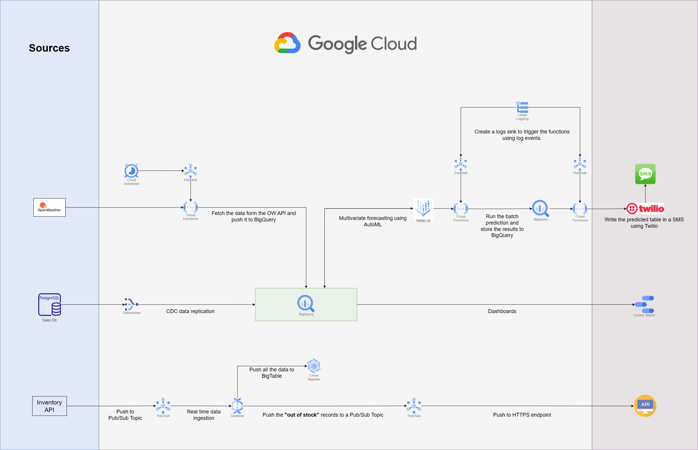

# Salads-XYZ Data Platform

Salads-XYZ is an imaginary fast-growing meal-kit company based in London that specializes in selling fresh salads. As the company is growing rapidly, they have decided to build their data platform on Google Cloud.

Salads-XYZ infrastructure includes one main internal kitchen and eight distributed stores around the city. They have two sources of data:

1. An **API endpoint** streaming inventory data for all stores.
2. A **PostgreSQL database** sales data.

## Proposed Solutions

They are looking to use GCP to develop two solutions:

1. **Real-Time Alerting Pipeline:** Ingest streaming inventory data in real-time and send an alert once any of the products is out of stock.
2. **Sales Forecast Report:** A daily sales forecasting report using machine learning to predict the number of sales for each product using the historical data on their database and weather data from OpenWeather API.

## Tech Stack

Our chosen technologies are as follows:

- **Languages:** SQL, Python.
- **GCP Services:** BigQuery, Vertex AI (Auto-ML), DataFlow, PubSub, Cloud Functions, Cloud Logging, Cloud Scheduler, BigTable, DataStream.
- **Third Party Services:** Twilio, OpenWeather.

## Architecture

